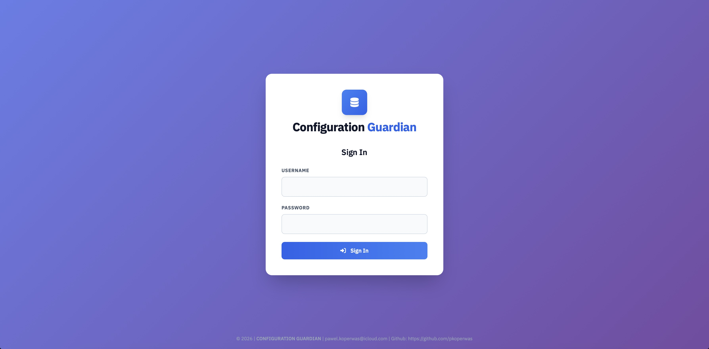
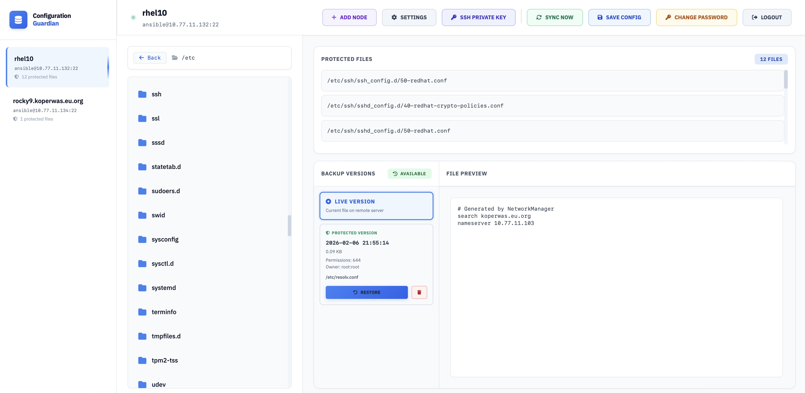
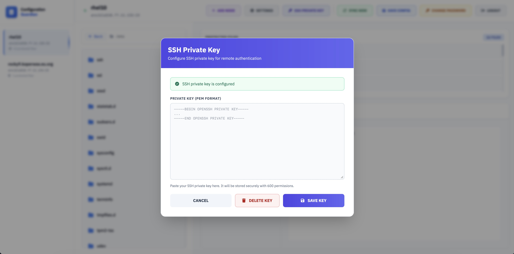
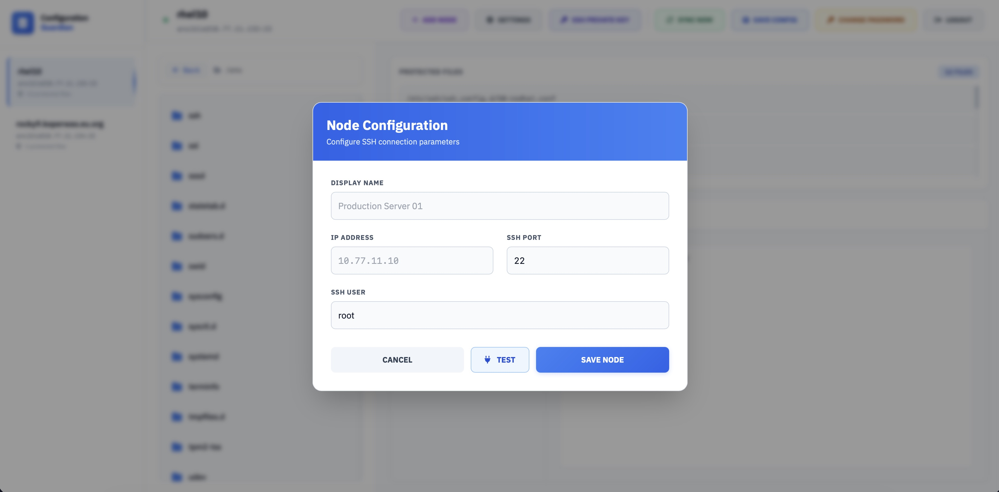

# 🛡️ Configuration Guardian


**Configuration Guardian** is a modern Python-based web application for **managing configuration backups from remote servers**.  
It runs as a service on port **8080** and provides a clean, intuitive **web GUI**.


---

## 📸 Screenshots

### Login page


### Files overview


### ssh-key management


### node configuration


---

## ⚡ Features

🟢 Web-based GUI for managing backups  
🟢 Scheduled (cyclic) synchronizations  
🟢 Backup from multiple remote servers  
🟢 Multiple versions (retention of copies)  
🟢 One-click restore from GUI  
🟢 Runs as a systemd service on port **8080**  
🟢 Docker and docker-compose support

---

## 🔧 How It Works

🔹 The app runs as a service on port `8080`  
🔹 You add servers and paths to back up in the GUI  
🔹 A scheduler performs periodic sync jobs  
🔹 Each backup is versioned  
🔹 Restore can be triggered with one click

---

## ⚠️ Limitations

🔴 No native LDAP/SSO authentication yet  
🔴 Backup works in agentless pull mode over SSH  
🔴 No encryption at rest (transport is secured)

---

## 💻 Installation (bare metal / VM)

### 📦 Deploy from repository

```bash
git clone https://github.com/pkoperwas/configuration-guardian.git
cd configuration-guardian
bash deploy.sh
```

The script will:
- install dependencies
- create and install a systemd unit file
- start the service

### ▶ Service management

```bash
systemctl status configuration-guardian
systemctl restart configuration-guardian
```

### 🌐 Access

```
http://<SERVER_IP>:8080
```

---

## 🐳 Docker

### 📄 Dockerfile

The repository contains a ready-to-use `Dockerfile`.

### 🚀 docker-compose

```bash
docker-compose up -d
```

After startup:

```
http://localhost:8080
```

---

## 💡 Use Cases

✅ Linux server configuration backup  
✅ Backup of /etc, /opt/app/config, playbooks, etc.  
✅ Fast restore after failure  
✅ Change auditing over time  
